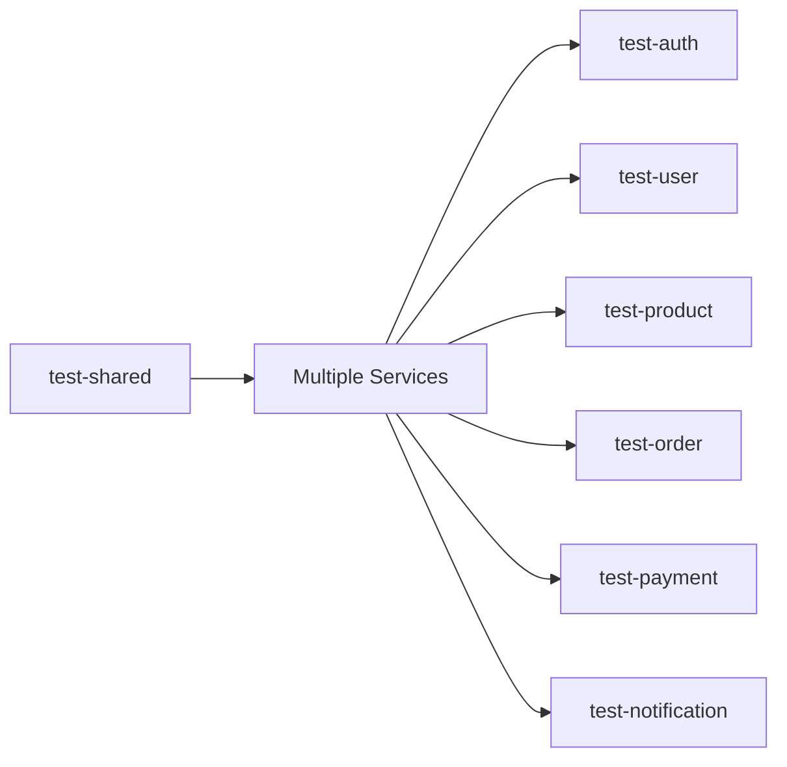

# NodeCart CI/CD Pipeline Documentation

## Overview

NodeCart uses GitHub Actions for continuous integration and continuous deployment. The pipeline ensures code quality, runs automated tests, builds Docker images, and performs security scans.

## 📋 Workflows

### 1. Main CI/CD Pipeline (`ci.yml`)

**Triggers:**
- Push to `main` or `develop` branches
- Pull requests to `main` or `develop` branches

**Jobs:**

#### Test Jobs (Parallel Execution)
1. **test-shared** - Tests shared library
2. **test-auth** - Tests Auth Service (MongoDB + Redis)
3. **test-user** - Tests User Service (PostgreSQL)
4. **test-product** - Tests Product Service (MongoDB)
5. **test-order** - Tests Order Service (MariaDB)
6. **test-payment** - Tests Payment Service (MongoDB)
7. **test-notification** - Tests Notification Service (MongoDB)

#### Build & Integration
8. **build-images** - Builds all Docker images (runs after tests pass)
9. **integration-tests** - Full stack integration tests with docker-compose

#### Quality & Security
10. **security-scan** - Trivy vulnerability scanning
11. **code-quality** - ESLint + SonarCloud analysis

#### Deployment
12. **deploy** - Pushes images to Docker Hub (main branch only)

**Total Pipeline Time:** ~15-20 minutes

---

### 2. Pull Request Checks (`pr-checks.yml`)

**Triggers:**
- Pull request opened/updated

**Jobs:**
- Quick validation (commit messages, file sizes, secrets check)
- PR size analysis
- Dependency audit
- Documentation check
- Auto-labeling
- Welcome comment on new PRs

**Purpose:** Fast feedback for developers before full CI runs

---

### 3. Nightly Security Scan (`nightly-security.yml`)

**Triggers:**
- Scheduled: Daily at 2 AM UTC
- Manual: Can be triggered via GitHub UI

**Jobs:**
- NPM audit for all services
- Docker image security scanning (Trivy)
- Infrastructure security (Checkov)
- Automatic issue creation on vulnerabilities found
- Slack notifications (if configured)

**Purpose:** Catch new vulnerabilities in dependencies

---

## 🔧 Setup Instructions

### Prerequisites

1. **GitHub Repository**
   ```bash
   git init
   git add .
   git commit -m "Initial commit"
   git branch -M main
   git remote add origin https://github.com/yourusername/NodeCart.git
   git push -u origin main
   ```

2. **Required Secrets** (Settings → Secrets and variables → Actions)

   | Secret | Required | Description |
   |--------|----------|-------------|
   | `DOCKER_USERNAME` | For deployment | Docker Hub username |
   | `DOCKER_PASSWORD` | For deployment | Docker Hub token/password |
   | `SONAR_TOKEN` | Optional | SonarCloud authentication token |
   | `SLACK_WEBHOOK` | Optional | Slack webhook for notifications |

### Setting up Docker Hub

1. Create account at https://hub.docker.com
2. Create access token:
   - Account Settings → Security → New Access Token
3. Add to GitHub Secrets:
   ```
   DOCKER_USERNAME: your-dockerhub-username
   DOCKER_PASSWORD: your-access-token
   ```

### Setting up SonarCloud (Optional)

1. Go to https://sonarcloud.io
2. Import your repository
3. Get your token from Account → Security
4. Add `SONAR_TOKEN` to GitHub Secrets

### Setting up Slack Notifications (Optional)

1. Create Slack webhook: https://api.slack.com/messaging/webhooks
2. Add `SLACK_WEBHOOK` to GitHub Secrets

---

## 🚀 Usage

### Running CI on Push

```bash
# Simply push to main or develop
git add .
git commit -m "feat: add new feature"
git push origin main
```

CI will automatically:
- Run all tests
- Build Docker images
- Run integration tests
- Deploy to Docker Hub (if on main branch)

### Creating a Pull Request

```bash
# Create feature branch
git checkout -b feature/my-feature

# Make changes and commit
git add .
git commit -m "feat: implement my feature"

# Push and create PR
git push origin feature/my-feature
```

GitHub will:
- Run PR checks immediately
- Add appropriate labels
- Comment with checklist
- Run full CI pipeline
- Report status on PR

### Manual Workflow Trigger

You can manually trigger workflows:

1. Go to Actions tab
2. Select workflow
3. Click "Run workflow"
4. Choose branch
5. Click "Run workflow" button

---

## 📊 Pipeline Stages Explained

### Stage 1: Unit Tests (Parallel)



Each service runs:
- `npm ci` - Install dependencies
- `npm test` - Run Jest tests
- Uploads coverage to Codecov

**Required Services:**
- Auth: MongoDB + Redis
- User: PostgreSQL
- Product: MongoDB
- Order: MariaDB
- Payment: MongoDB
- Notification: MongoDB

### Stage 2: Build Docker Images

```yaml
Strategy: Matrix build (parallel)
Services:
  - auth-service
  - user-service
  - product-service
  - order-service
  - payment-service
  - notification-service
  - api-gateway

Cache: GitHub Actions cache (speeds up rebuilds)
```

### Stage 3: Integration Tests

1. **Start Infrastructure:**
   - MongoDB
   - PostgreSQL
   - MariaDB
   - Redis
   - RabbitMQ

2. **Start Microservices:**
   - All 6 services
   - API Gateway

3. **Run Tests:**
   - Health checks
   - API Gateway accessibility
   - Auth flow (register user)
   - Product listing

4. **Cleanup:**
   - Stop all containers
   - Remove volumes

### Stage 4: Security & Quality

**Trivy Scan:**
- Scans codebase for vulnerabilities
- Checks Docker images
- Reports to GitHub Security tab

**SonarCloud (if configured):**
- Code smells
- Code coverage
- Duplications
- Security hotspots
- Technical debt

### Stage 5: Deployment

**On main branch only:**

```bash
# Tags images with:
- latest
- git SHA (for rollback capability)

# Pushes to Docker Hub:
yourusername/nodecart-auth-service:latest
yourusername/nodecart-auth-service:abc1234
```

---

## 🎯 Best Practices

### Commit Messages

Follow conventional commits:

```bash
feat: add user profile endpoint
fix: resolve authentication bug
docs: update API documentation
test: add integration tests for orders
chore: update dependencies
refactor: improve error handling
perf: optimize database queries
```

### Pull Request Workflow

1. **Create feature branch:**
   ```bash
   git checkout -b feature/your-feature
   ```

2. **Make small, focused commits:**
   ```bash
   git commit -m "feat: implement user registration"
   git commit -m "test: add registration tests"
   ```

3. **Keep PRs small:**
   - < 50 files changed
   - < 1000 lines changed
   - Single responsibility

4. **Update tests:**
   - Add tests for new features
   - Update tests for changes
   - Ensure coverage doesn't drop

5. **Update documentation:**
   - Update README if needed
   - Add/update API docs
   - Update CHANGELOG

### Handling Failed Builds

**Tests Failed:**
```bash
# View logs in GitHub Actions
# Fix the issue locally
npm test

# Push fix
git add .
git commit -m "fix: resolve failing tests"
git push
```

**Build Failed:**
```bash
# Check Docker build locally
docker-compose build service-name

# Fix Dockerfile or dependencies
# Push fix
```

**Security Issues:**
```bash
# Update vulnerable package
cd services/auth-service
npm audit fix

# Or manually update in package.json
npm install package-name@latest

# Commit and push
git add package*.json
git commit -m "chore: update vulnerable dependencies"
git push
```

---

## 🔍 Monitoring & Debugging

### View Workflow Runs

1. Go to GitHub repository
2. Click "Actions" tab
3. Select workflow run
4. Click on failed job
5. Expand failed step

### Download Artifacts

Some workflows upload artifacts:
- Test coverage reports
- Security scan results
- Build logs

To download:
1. Go to workflow run
2. Scroll to "Artifacts" section
3. Click to download

### Enable Debug Logging

Add secrets for debug mode:
```
ACTIONS_STEP_DEBUG: true
ACTIONS_RUNNER_DEBUG: true
```

### Common Issues

**Issue: Tests timeout**
```yaml
# Increase timeout in workflow:
timeout-minutes: 20
```

**Issue: Docker build fails**
```bash
# Test locally first:
docker-compose build service-name

# Check for:
- Missing files
- Wrong paths
- Network issues
```

**Issue: Integration tests fail**
```bash
# Check logs:
docker-compose logs service-name

# Common causes:
- Services not ready
- Database connection issues
- Port conflicts
```

---

## 📈 Metrics & Analytics

### Pipeline Performance

Track these metrics:
- **Average build time**: ~15-20 minutes
- **Success rate**: Target > 95%
- **Time to feedback**: < 5 minutes (PR checks)
- **Deployment frequency**: As needed

### Code Quality Metrics

Monitor in SonarCloud:
- Code coverage: Target > 80%
- Code smells: Target < 100
- Duplications: Target < 3%
- Security hotspots: Target 0

---

## 🔐 Security

### Secrets Management

- Never commit secrets to repository
- Use GitHub Secrets for sensitive data
- Rotate tokens regularly
- Use minimal permission scopes

### Dependency Updates

Dependabot automatically:
- Checks for updates weekly
- Creates PRs for updates
- Groups by service
- Includes changelog

Review and merge promptly!

### Security Scanning

Multiple layers:
1. **NPM Audit**: Checks Node.js dependencies
2. **Trivy**: Scans Docker images
3. **Checkov**: Validates infrastructure code
4. **Nightly Scans**: Catches new vulnerabilities

